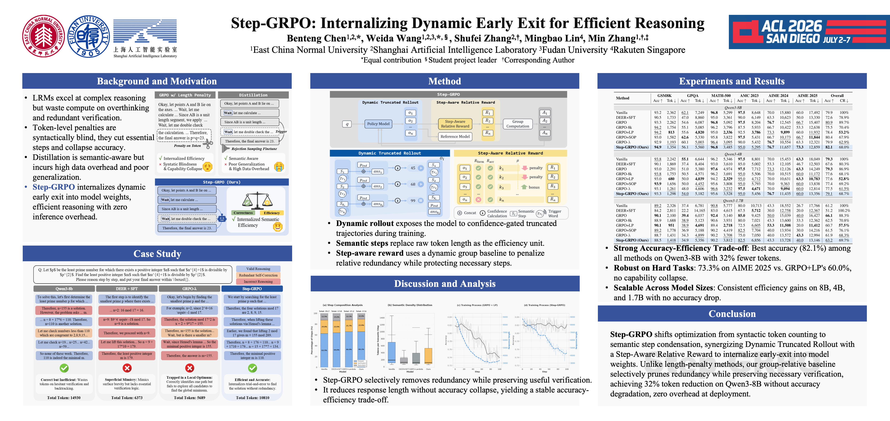

<h1 align="center">Step-GRPO: Internalizing Dynamic Early Exit for Efficient Reasoning</h1>

<p align="center">
  <strong>Benteng Chen</strong><sup>1,2,*</sup>,
  <strong>Weida Wang</strong><sup>1,2,3,*,§</sup>,
  <strong>Shufei Zhang</strong><sup>2,†</sup>,
  <strong>Mingbao Lin</strong><sup>4</sup>,
  <strong>Min Zhang</strong><sup>1,†,‡</sup>
  <br>
  <sup>1</sup>East China Normal University &nbsp;
  <sup>2</sup>Shanghai AI Laboratory &nbsp;
  <sup>3</sup>Fudan University &nbsp;
  <sup>4</sup>Rakuten Singapore
  <br>
  <sup>*</sup>Equal contribution &nbsp;
  <sup>§</sup>Student project leader &nbsp;
  <sup>‡</sup>Project leader &nbsp;
  <sup>†</sup>Corresponding authors
</p>

> **Step-GRPO has been accepted as a long paper at ACL 2026.**

## Overview

Large reasoning models that use long chain-of-thought excel at problem-solving yet waste compute on redundant checks. Curbing this overthinking is hard: training-time length penalties can cripple ability, while inference-time early-exit adds system overhead. To bridge this gap, we propose **Step-GRPO**, a novel post-training framework that internalizes dynamic early-exit capabilities directly into the model. Step-GRPO shifts the optimization objective from raw tokens to semantic steps by utilizing linguistic markers to structure reasoning. We introduce a *Dynamic Truncated Rollout* mechanism that exposes the model to concise high-confidence trajectories during exploration, synergized with a *Step-Aware Relative Reward* that dynamically penalizes redundancy based on group-level baselines. Extensive experiments across three model sizes on diverse benchmarks demonstrate that Step-GRPO achieves a superior accuracy-efficiency trade-off. On Qwen3-8B, our method reduces token consumption by 32.0\% compared to the vanilla model while avoiding the accuracy degradation observed in traditional length-penalty methods.

<p align="center">
  
</p>

## Quick start

For detailed environment setup and dependencies, please refer to [EasyR1](https://github.com/hiyouga/EasyR1).

Use [`examples/qwen3_8b_math_step_grpo.sh`](examples/qwen3_8b_math_step_grpo.sh) as the reference training script. Update `MODEL_PATH`, `TRAIN_FILE`, and `VAL_FILE` in the script for your environment, then run:

```bash
bash examples/qwen3_8b_math_step_grpo.sh
```

For a short one-GPU sanity check, use examples/qwen3_8b_step_grpo_smoke.sh.

## Citation

```bibtex
@inproceedings{chen2026step,
  title={Step-GRPO: Internalizing Dynamic Early Exit for Efficient Reasoning},
  author={Chen, Benteng and Wang, Weida and Zhang, Shufei and Lin, Mingbao and Zhang, Min},
  booktitle={Proceedings of the 64th Annual Meeting of the Association for Computational Linguistics (Volume 1: Long Papers)},
  pages={21710--21724},
  year={2026}
}
```

## Acknowledgements

- We thank [EasyR1](https://github.com/hiyouga/EasyR1) for providing the efficient and scalable reinforcement-learning training framework on which this implementation is built.
- We thank [DEER](https://github.com/iie-ycx/DEER) for its dynamic early-exit method and reference implementation, which inspired our Dynamic Truncated Rollout.
